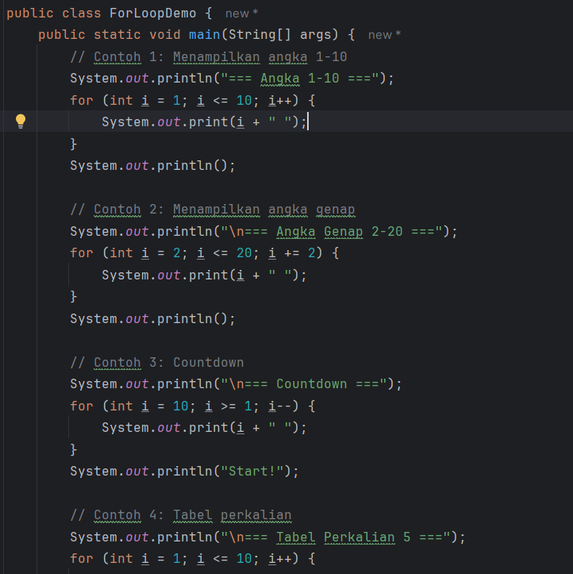

# Laporan Modul 2: Dasar Pemrograman Java
**Mata Kuliah:** Praktikum Pemrograman Berorientasi Objek   
**Nama:** [RIDHO RYAN GHIFARI]  
**NIM:** [2024573010032]  
**Kelas:** [TI 2E]

---

## 1. Abstrak
Laporan ini berisi rangkaian praktikum pemrograman dasar yang meliputi empat pokok bahasan utama, yaitu variabel dan tipe data, operator, struktur kontrol percabangan, serta struktur kontrol perulangan. Setiap praktikum dilakukan dengan tujuan untuk memahami konsep dasar pemrograman, cara kerja masing-masing struktur, serta penerapannya dalam membuat program sederhana menggunakan bahasa Java.

Praktikum 1 membahas tentang penggunaan variabel dan tipe data untuk menyimpan serta mengelola data. Praktikum 2 menjelaskan penggunaan operator aritmatika, logika, relasi, dan penugasan dalam mengolah data. Praktikum 3 membahas struktur kontrol percabangan yang memungkinkan program mengambil keputusan berdasarkan kondisi tertentu. Praktikum 4 berfokus pada struktur kontrol perulangan (for, while, do-while, dan nested loop) yang digunakan untuk menjalankan instruksi secara berulang.

Tujuan dari penyusunan laporan ini adalah agar mahasiswa mampu memahami dasar-dasar pemrograman secara sistematis, menguasai konsep logika pemrograman, serta dapat mengaplikasikannya dalam membangun program yang efisien, interaktif, dan mudah dikembangkan.

---
## 2. Praktikum
### Praktikum 1 - Variabel dan Tipe Data
#### Dasar Teori
1. Variabel
Variabel adalah tempat untuk menyimpan data di dalam memori komputer yang memiliki nama dan tipe data tertentu.

- int → bilangan bulat.

- double → bilangan pecahan dengan presisi ganda.

- char → karakter tunggal.

- boolean → nilai logika true atau false.

- String → kumpulan karakter (teks).

- Setiap tipe data memiliki ukuran memori yang berbeda:

- byte : 1 byte (–128 s.d 127)

- short: 2 byte (–32.768 s.d 32.767)

- int : 4 byte (–2,1 miliar s.d 2,1 miliar)

- long : 8 byte

- float: 4 byte pecahan

- double: 8 byte pecahan

2. Operator Aritmatika

+ → penjumlahan

- → pengurangan

* → perkalian

- / → pembagian (jika integer maka hasil dibulatkan)

- % → modulo (sisa bagi)

3. Type Casting

Implicit casting (widening) → otomatis dilakukan oleh Java ketika tipe data lebih kecil disimpan dalam tipe data lebih besar (contoh: int → double).

Explicit casting (narrowing) → dilakukan secara manual dengan menuliskan (tipeData) di depan variabel (contoh: (int) 9.8).

Automatic Promotion
Saat operasi aritmatika dilakukan dengan tipe data yang berbeda, Java akan secara otomatis “memperluas” (promote) ke tipe data yang lebih besar agar tidak terjadi kehilangan informasi. Misalnya:

byte + short → hasilnya int.

int + double → hasilnya double.
#### Langkah Praktikum
1. Membuat class Java bernama VariableDemo.

2. Mendeklarasikan variabel berbagai tipe data (int, double, char, boolean, String).

3. Menampilkan nilai variabel ke layar dengan System.out.println().

4. Melakukan operasi aritmatika sederhana dengan dua variabel a dan b.

5. Melakukan casting tipe data dari double ke int.

6. Menunjukkan automatic promotion dengan operasi byte + short.

7. Menjalankan program dan mengamati hasil output.
#### Screenshoot Hasil

#### Analisa dan Pembahasan
1. Deklarasi Variabel
Variabel nama, umur, tinggi, grade, dan lulus berhasil menampilkan nilai sesuai tipe datanya. Hal ini menunjukkan bahwa Java mewajibkan deklarasi variabel dengan tipe data yang jelas (strongly typed language).

2. Operator Aritmatika
Operasi a / b = 10 / 3 menghasilkan 3, bukan 3.333… karena kedua operand bertipe int. Jika salah satu operand diubah ke double, hasil akan menjadi pecahan (3.333…).

3. Type Casting
Casting dari double ke int menghilangkan nilai desimal tanpa pembulatan (truncation). Contoh: 9.8 → 9. Ini penting untuk dipahami karena bisa menyebabkan kehilangan presisi.

4. Automatic Promotion
Pada operasi byte + short, hasilnya bukan short melainkan int. Java otomatis mengangkat tipe data kecil ke int untuk mencegah kesalahan perhitungan.
Hal ini juga berlaku untuk int + double → hasilnya double.

5. Kesimpulan Perilaku Program

- Java mengharuskan tipe data yang sesuai dalam setiap operasi.

- Operator aritmatika menghasilkan output sesuai tipe operand.

- Casting diperlukan untuk mengubah tipe data, tetapi ada konsekuensi berupa hilangnya data desimal.

- Automatic promotion mempermudah operasi aritmatika dengan tipe data berbeda tanpa harus melakukan casting manual.

### Praktikum 2 - Input, Output dan Scanner
#### Dasar Teori
Struktur kontrol percabangan dalam bahasa pemrograman digunakan untuk membuat keputusan berdasarkan kondisi tertentu. Percabangan memungkinkan program menjalankan alur yang berbeda sesuai dengan input atau kondisi yang diberikan.
Beberapa bentuk percabangan di Java adalah:

If-Else
Digunakan untuk memilih satu atau lebih blok kode berdasarkan kondisi boolean.

If-Else If-Else
Untuk mengevaluasi banyak kondisi secara berurutan hingga salah satunya benar.

Nested If (If Bersarang)
Digunakan jika di dalam satu kondisi masih terdapat percabangan kondisi lainnya.

Switch-Case
Cocok digunakan untuk kondisi yang memeriksa nilai diskrit (misalnya angka pilihan menu).

Struktur percabangan ini sangat penting agar program lebih fleksibel, interaktif, dan mampu menyelesaikan berbagai kasus logika.
#### Langkah Praktikum
1. Buat file Java dengan nama InputOutputDemo.java.

2. Import library java.util.Scanner di awal program.

3. Baca input dari user dengan metode nextLine(), nextInt(), dan nextDouble().

4. Simpan input ke variabel sesuai tipe data (String, int, double).

5. Tampilkan kembali hasil input dengan System.out.println().

6. Tutup scanner menggunakan input.close(); agar resource tidak bocor.

7. Jalankan program dan masukkan data yang diminta.
#### Screenshoot Hasil

#### Analisa dan Pembahasan
1. Input String
Dengan nextLine(), program membaca satu baris teks, termasuk spasi. Cocok digunakan untuk nama lengkap.

2. Input Integer
Dengan nextInt(), program membaca bilangan bulat. Jika pengguna memasukkan nilai selain angka, program akan error.

3. Input Double
Dengan nextDouble(), program membaca bilangan desimal. Misalnya: 175.5.

4. Output
Program menampilkan kembali data yang dimasukkan user, sehingga pengguna bisa memverifikasi apakah data sudah benar.

5. Manfaat Scanner

6. Mempermudah interaksi antara program dan pengguna.

7. Mendukung berbagai tipe data input.

8. Sangat berguna dalam pembuatan aplikasi berbasis teks.

### Praktikum 3 - Struktur Control: Percabangan
#### Dasar Teori 
Struktur kontrol percabangan dalam bahasa pemrograman digunakan untuk membuat keputusan berdasarkan kondisi tertentu. Percabangan memungkinkan program menjalankan alur yang berbeda sesuai dengan input atau kondisi yang diberikan.
Beberapa bentuk percabangan di Java adalah:

- If-Else
Digunakan untuk memilih satu atau lebih blok kode berdasarkan kondisi boolean.

- If-Else If-Else
Untuk mengevaluasi banyak kondisi secara berurutan hingga salah satunya benar.

- Nested If (If Bersarang)
Digunakan jika di dalam satu kondisi masih terdapat percabangan kondisi lainnya.

- Switch-Case
Cocok digunakan untuk kondisi yang memeriksa nilai diskrit (misalnya angka pilihan menu).

Struktur percabangan ini sangat penting agar program lebih fleksibel, interaktif, dan mampu menyelesaikan berbagai kasus logika.
#### Langkah Praktikum 
1. Buka editor Java (misalnya IntelliJ, NetBeans, atau VS Code).

2. Buat tiga file program Java dengan nama:

- GradeDemo.java (contoh if-else if)

- MenuDemo.java (contoh switch-case)

- NestedIfDemo.java (contoh nested if)

3. Ketikkan kode program sesuai instruksi.

4. Jalankan program dan masukkan input sesuai kasus.

5. Amati output hasil program.

6. Dokumentasikan hasil dalam bentuk screenshot.
#### Screenshoot Hasil

#### Analisa dan Pembahasan
1. Pada GradeDemo.java, percabangan if-else if digunakan untuk menentukan nilai huruf dan keterangan berdasarkan skor numerik. Program berhasil menampilkan hasil sesuai dengan rentang nilai yang dimasukkan.

2. Pada MenuDemo.java, percabangan switch-case lebih efisien digunakan karena input berupa angka pilihan menu. Program dapat menghitung luas persegi, lingkaran, dan segitiga sesuai pilihan user.

3. Pada NestedIfDemo.java, percabangan if bersarang digunakan untuk mengklasifikasikan umur ke dalam kategori tertentu. Program berjalan sesuai logika, meskipun kode terlihat lebih panjang dibandingkan if-else biasa.

4. Secara umum, penggunaan jenis percabangan harus disesuaikan dengan kebutuhan:

- If-Else: cocok untuk kondisi sederhana.

- If-Else If: cocok untuk banyak kondisi bertingkat.

- Nested If: digunakan jika ada percabangan di dalam percabangan.

- Switch-Case: cocok untuk pilihan menu dengan nilai yang terbatas.

### Praktikum 4 -  Struktur Control: Perulangan
#### Dasar Teori
Struktur perulangan (looping) adalah konsep dasar dalam pemrograman yang digunakan untuk menjalankan serangkaian perintah secara berulang berdasarkan kondisi tertentu. Dalam Java, terdapat beberapa jenis perulangan, yaitu:

1. For Loop
Digunakan ketika jumlah perulangan sudah diketahui. Struktur umumnya:

for (inisialisasi; kondisi; increment/decrement) {
// blok kode
}

2. While Loop
Digunakan ketika jumlah perulangan belum diketahui dan bergantung pada kondisi. Perulangan akan terus berjalan selama kondisi bernilai benar (true).

while (kondisi) {
// blok kode
}

3. Do-While Loop
Hampir sama dengan while loop, namun minimal satu kali perulangan dijalankan walaupun kondisi bernilai salah (false).

do {
// blok kode
} while (kondisi);

4. Nested Loop (Perulangan Bersarang)
Loop yang berada di dalam loop lain. Biasanya digunakan untuk membuat pola, tabel, atau perhitungan multidimensi.
#### Langkah Praktikum 
1. Membuat program ForLoopDemo untuk menampilkan:

- Deret angka 1-10

- Angka genap 2-20

- Countdown dari 10 ke 1

- Tabel perkalian 5

2. Membuat program WhileLoopDemo yang berisi:

- Permainan tebak angka menggunakan while loop

- Menu interaktif menggunakan do-while loop

3. Membuat program NestedLoopDemo untuk menampilkan:

- Pola bintang segitiga

- Tabel perkalian 1-5

- Pola angka segitiga
#### Screenshoot Hasil 

#### Analisa dan Pembahasan
- For Loop cocok digunakan ketika jumlah iterasi sudah pasti, contohnya menampilkan angka 1–10 atau tabel perkalian.

- While Loop lebih fleksibel untuk kondisi tidak pasti, contohnya pada game tebak angka yang akan terus berulang hingga jawaban benar.

- Do-While Loop menjamin perulangan minimal berjalan sekali, cocok untuk menu interaktif.

- Nested Loop efektif untuk menampilkan pola berulang dua dimensi, misalnya tabel perkalian dan segitiga bintang.

- Dengan memahami perulangan, proses komputasi menjadi lebih efisien, sederhana, dan mengurangi redundansi kode.

## 3. Kesimpulan

Dari hasil praktikum 1 sampai 4 dapat disimpulkan bahwa konsep dasar pemrograman terdiri atas variabel, operator, percabangan, dan perulangan yang saling berkaitan dan menjadi fondasi utama dalam pembuatan program.

- Variabel dan tipe data berfungsi untuk menyimpan dan mengelola berbagai macam nilai agar dapat digunakan dalam proses komputasi.

- Operator memungkinkan dilakukannya operasi aritmatika, logika, perbandingan, maupun penugasan terhadap variabel sehingga program dapat memproses data dengan benar.

- Struktur kontrol percabangan memberi kemampuan kepada program untuk mengambil keputusan berdasarkan kondisi tertentu, sehingga alur program menjadi lebih dinamis dan sesuai kebutuhan.

- Struktur kontrol perulangan memungkinkan instruksi dijalankan berulang kali, baik dengan jumlah iterasi tertentu maupun sampai kondisi tertentu terpenuhi, sehingga program menjadi lebih efisien dan ringkas.

Secara keseluruhan, pemahaman keempat materi ini sangat penting karena merupakan dasar untuk menyusun program yang interaktif, fleksibel, dan mampu menyelesaikan permasalahan secara sistematis. Dengan menguasainya, mahasiswa dapat mengembangkan logika pemrograman yang kuat serta siap untuk mempelajari konsep pemrograman yang lebih lanjut.

---

## 5. Referensi
- Dokumentasi Resmi Oracle Java — https://docs.oracle.com/javase/tutorial/

- Buku Pemrograman Java untuk Pemula — https://www.petanikode.com/java/

- W3Schools Java Tutorial — https://www.w3schools.com/java/
---